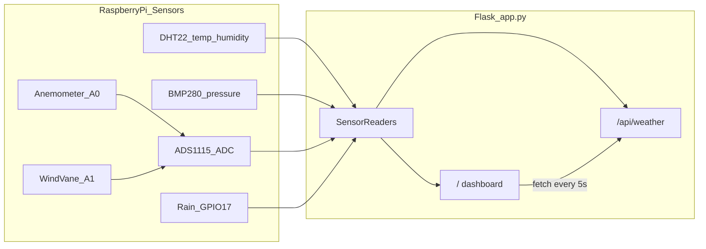

# Weather Station

> A personal weather station running on Raspberry Pi — reads real sensors and serves a live dashboard plus a JSON API.

[](https://www.python.org/)
[](https://flask.palletsprojects.com/)
[](https://www.raspberrypi.com/)
[](LICENSE)

---

## About

I built this because I wanted to see weather data from **my own sensors**, not from a phone app or a forecast API. It started as a weekend experiment with a Raspberry Pi and a handful of cheap modules — temperature, humidity, pressure, wind, rain — wired up on a breadboard and read through Python.

The result is a small Flask app that:

- reads physical sensors over GPIO and I2C
- exposes the data through a simple REST endpoint
- renders a dark-themed dashboard that refreshes every 5 seconds

This is not a commercial product or a production-grade IoT platform. It is an open-source side project I use to learn, tinker, and share. If you are building something similar, I hope the wiring notes and code save you some time.

---

## Features

| Feature | Description |
|---------|-------------|
| Temperature & humidity | DHT22 sensor |
| Pressure & altitude | BMP280 over I2C |
| Wind speed | Anemometer via ADS1115 ADC (channel A0) |
| Wind direction | Potentiometer-based vane via ADS1115 (channel A1) |
| Rain detection | Digital rain sensor on GPIO |
| Live dashboard | Auto-refreshing web UI |
| JSON API | `GET /api/weather` for raw sensor data |

No external weather APIs are used — everything comes from local hardware on the Pi.

---

## Architecture



---

## Hardware

| Component | Role |
|-----------|------|
| Raspberry Pi 4 | Main controller |
| DHT22 | Temperature & humidity |
| BMP280 | Pressure & altitude (I2C) |
| ADS1115 | Analog-to-digital converter (I2C) |
| Anemometer | Wind speed (ADS1115 A0) |
| Potentiometer / wind vane | Wind direction (ADS1115 A1) |
| Rain sensor module | Rain detection (GPIO) |
| Breadboard & jumper wires | Wiring |

### Pin summary

| Sensor | Pin / Bus |
|--------|-----------|
| DHT22 DATA | GPIO 27 (Pin 13) |
| Rain sensor | GPIO 17 (Pin 11) |
| BMP280 SDA / SCL | Pin 3 / Pin 5 (I2C) |
| ADS1115 SDA / SCL | Shared I2C bus with BMP280 |
| Anemometer signal | ADS1115 A0 |
| Wind direction signal | ADS1115 A1 |

For a full pin-by-pin wiring guide, see [`hava_istasyonu_baglanti_semasi.md`](hava_istasyonu_baglanti_semasi.md) (Turkish).

### Raspberry Pi setup

Enable I2C before running the app:

```bash
sudo raspi-config
# Interface Options → I2C → Enable
```

Verify connected devices:

```bash
sudo i2cdetect -y 1
```

BMP280 usually appears at `0x76` or `0x77`, ADS1115 at `0x48`.

---

## Getting started

### Requirements

- Raspberry Pi OS (or compatible Linux)
- Python 3.7+
- Internet access for the initial setup

### 1. Clone the repo

```bash
git clone https://github.com/dogukannparlak/Weather-Station.git
cd Weather-Station
```

### 2. Create a virtual environment

```bash
sudo apt update
sudo apt install python3-venv python3-pip -y
python3 -m venv venv
source venv/bin/activate
```

### 3. Install dependencies

```bash
pip install -r requirements.txt
```

> These packages require Raspberry Pi OS with GPIO and I2C support. They will not run with full hardware access on Windows or macOS.

### 4. Run the app

```bash
python app.py
```

Open in a browser:

```
http://<raspberry_pi_ip>:5000/
```

API endpoint:

```
http://<raspberry_pi_ip>:5000/api/weather
```

The app uses Flask's built-in development server on port 5000, bound to all interfaces (`0.0.0.0`). That is fine for a home LAN setup; do not expose it directly to the internet without a proper reverse proxy and authentication.

---

## API reference

### `GET /api/weather`

Returns all sensor readings as JSON.

**Example response:**

```json
{
  "pressure": 0.987,
  "altitude": 142.531,
  "temp_dht": 24.5,
  "humidity": 58.2,
  "wind_speed": 12.4,
  "wind_direction": "North",
  "rain_status": "No Rain",
  "update_time": "2026-05-21 14:30:00"
}
```

| Field | Unit / format | Source |
|-------|---------------|--------|
| `temp_dht` | °C | DHT22 |
| `humidity` | % | DHT22 |
| `pressure` | Normalized pressure ratio (`pressure / 1025`) | BMP280 |
| `altitude` | meters | BMP280 |
| `wind_speed` | km/h | Anemometer |
| `wind_direction` | `East` / `North` / `West` / `South` | Potentiometer |
| `rain_status` | `Rain` or `No Rain` | Rain sensor |
| `update_time` | UTC+3 timestamp | Server |

If a sensor read fails, its field is returned as `null`.

---

## Project structure

```
Weather-Station/
├── app.py                              # Flask app & sensor logic
├── templates/
│   └── index.html                      # Dashboard UI
├── requirements.txt                    # Python dependencies
├── LICENSE                             # MIT license
├── CONTRIBUTING.md                     # Contribution guide
├── hava_istasyonu_baglanti_semasi.md   # Hardware wiring (Turkish)
├── Flask_Weather_Station_Documentation.md  # Additional technical notes (Turkish)
└── README.md                           # This file
```

---

## Calibration

Some conversion formulas are hardware-specific and may need tuning for your setup:

- **Wind speed:** `voltage × 8` → m/s, then converted to km/h
- **Wind direction:** `(voltage / 3.3) × 270` degrees, mapped to four compass buckets
- **Pressure reference:** sea-level pressure set to `1025 hPa` via `bmp280.sea_level_pressure`

Adjust these constants in `app.py` after comparing readings against a known reference instrument.

---

## Troubleshooting

| Problem | Things to check |
|---------|-----------------|
| BMP280 not detected | Run `i2cdetect -y 1`; try address `0x76` or `0x77` |
| DHT22 returns `null` | Wiring on GPIO 27, 3.3V power, add a 10k pull-up if needed |
| Rain sensor always reads "Rain" | Confirm your module uses `GPIO.LOW` for rain; invert logic if needed |
| Permission errors on GPIO | Run as a user with GPIO access, or check group membership on Pi OS |
| App works on Pi but not on PC | Expected — `board`, `RPi.GPIO`, and sensor libs need Pi hardware |
| Flask warning about dev server | Normal for local use; use Gunicorn + systemd for always-on deployment |

---

## Roadmap

Ideas I may tackle over time — no promises on timeline:

- [ ] Move sensor logic into a separate module (`sensors.py`)
- [ ] Configurable pins and calibration via environment variables
- [ ] SQLite or InfluxDB for historical data
- [ ] systemd unit + Gunicorn for running on boot
- [ ] Mock/dev mode for UI work without hardware attached

---

## Contributing

Contributions are welcome — even small fixes. See [CONTRIBUTING.md](CONTRIBUTING.md) for the workflow.

Found a bug or have an idea? [Open an issue](https://github.com/dogukannparlak/Weather-Station/issues).

---

## License

This project is released under the [MIT License](LICENSE). Use it, modify it, and share it however you like.

---

## Author

**Doğukan Parlak**

- GitHub: [@dogukannparlak](https://github.com/dogukannparlak)
- Repo: [Weather-Station](https://github.com/dogukannparlak/Weather-Station)

---

## Additional documentation

These files are kept as supplementary material (Turkish):

- [`hava_istasyonu_baglanti_semasi.md`](hava_istasyonu_baglanti_semasi.md) — detailed wiring diagram
- [`Flask_Weather_Station_Documentation.md`](Flask_Weather_Station_Documentation.md) — setup walkthrough and code notes

If this project helped you, a star on GitHub is always appreciated.
